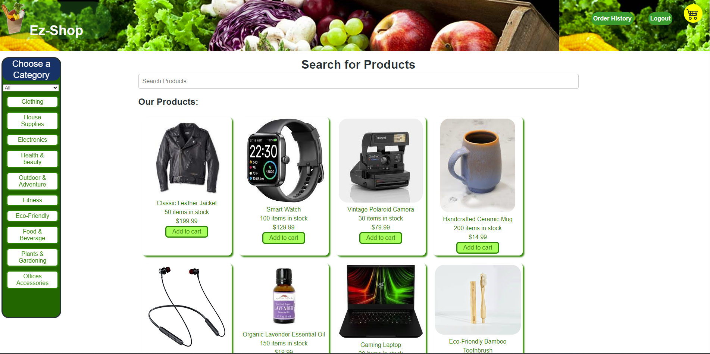

# EZ-shop

## Table of Contents
- [Description](#description)
- [Technology](#technology)
- [Installation](#installation)
- [Features](#features)
- [License](#license)
- [Contribution](#contribution)
- [Questions](#questions)

### Description

Welcome to Shop-EZ, a robust and user-friendly application designed to facilitate seamless online shopping experiences. This platform serves as a virtual marketplace, connecting businesses and consumers in a secure and efficient manner. With a focus on usability, security, and performance, Shop-EZ is equipped with features to enhance both the buyer and seller journey.

### Technologies

Vite, React, MongoDB, Express.js, Graphql, Stripe, Bootstrap

### Installation

1. Clone this repository to your local machine.
2. Navigate to the project directory
3. Run the following commands in your terminal
```sh
npm install
npm run seed
npm run develop
```
4. Open your browser and visit `http://localhost:3000` to see the application in action.

### Features

* Product Catalog: Browse through a diverse range of products with detailed descriptions, images, and pricing information.
* Shopping Cart: Easily manage selected items, review, and modify orders before proceeding to a secure checkout.
* Secure Checkout: Utilize Stripe for a safe and reliable transaction process. (Currently in Test Mode)
* User Accounts: Create and manage user accounts to personalize the shopping experience and track order history.
* Search and Filter: Find what you need with our interactive menu to narrow your product search.

## Heroku Deployment

https://shop-ez-015c83fa6fdb.herokuapp.com/

## ScreenShot



### License

[](LICENSE)

### Contribution

Robert Coulson, Marc Vargas, Joseph Palafos, and Sean Rowan

### Questions

You can view more of our projects or contact us at https://github.com/RobertC91, https://github.com/SeanDRowan, https://github.com/Palafos23, and https://github.com/MarcV623.
